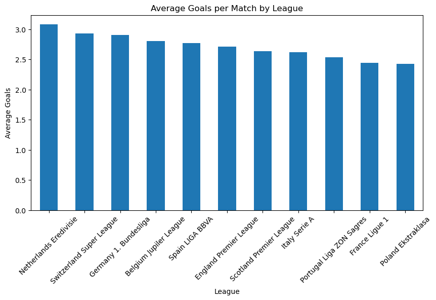
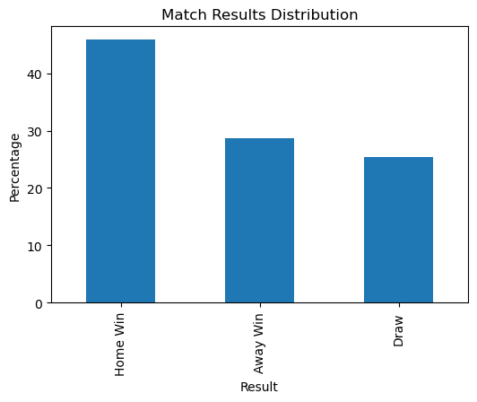
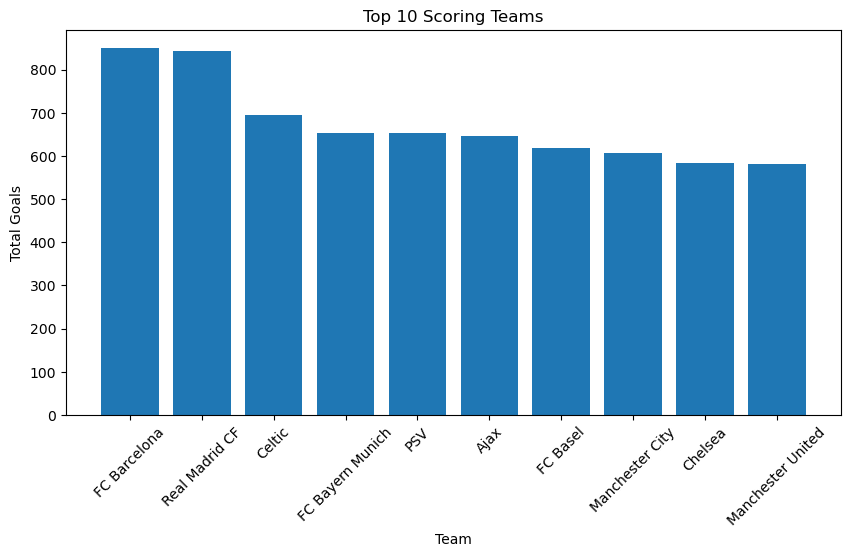
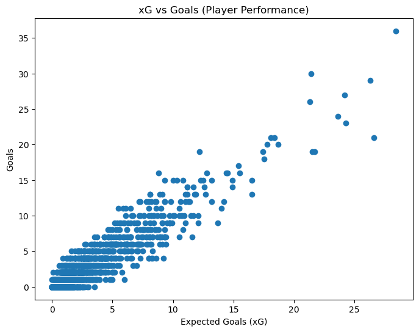
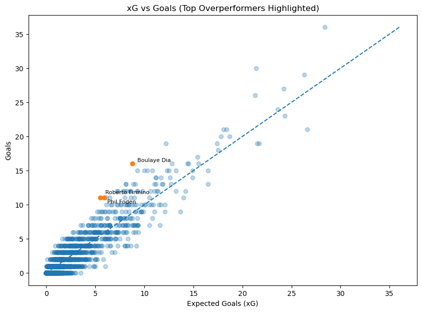

# Sports Analytics Portfolio Projects

This repository contains sports analytics projects focused on football performance analysis using Python, SQL, and data visualization.

The goal of these projects is to explore match and player performance through structured analysis, clear visualizations, and interpretable insights.

## Tools Used
- Python
- Pandas
- SQlite
- Matplotlib
- Jupyter Notebook
  
# Project 1: Offensive Performance and Home Advantage in European Football

## Overview

This project explores offensive performance and match outcomes across European football leagues using historical match data stored in a relational database.

The analysis focuses on identifying goal-scoring patterns, evaluating home advantage, and comparing offensive production across teams.

### Main questions

- Which leagues have the highest average goals per match?
- How strong is home advantage?
- Which teams produce the highest number of goals

### Key Insights
- Goal-scoring patterns are relatively consistent across leagues
- Home teams win significantly more often than away teams
- Offensive production is concentrated among a small number of clubs
 
 
### Visualizations

#### Average Goals per Match by League

 

#### Match Result Distribution

 

#### Top Scoring Teams
 
 
 
## Limitations

- Does not include expected goals (xG)  
- No player-level performance analysis  
- Limited temporal analysis  

## Project 2: Player Efficiency Analysis using Expected Goals (xG)
 
### Overview

This project evaluates player-level offensive efficiency across Europe’s top 5 leagues using expected goals (xG) as a measure of chance quality.

### Main questions

- Which players score more than expected based on xG?
- How strong is the relationship between xG and actual goals?
- Which players stand out as overperformers?

### Key insights

- xG shows a strong positive relationship with actual goals
- Most players perform close to expected levels
- A small group of players significantly outperform their xG
- Overperformance may reflect finishing skill, but also variance

### Visualizations

#### xG vs Goals

#### xG vs Goals with Top Overperformers Highlighted

### Files

- `player_xg_analysis/notebooks/player_xg_analysis.ipynb`

## 📌 Notes

- Large raw database files were excluded from the repository to comply with GitHub file limits.
- The focus of this repository is on analysis, interpretation, and visualization.

## 🚀 Next Steps

Future projects may include:

- player-level per 90 analysis
- underperformer analysis
- multi-season comparisons
- defensive metrics
- interactive dashboards

## Author

Gabriela Cárdenas  
Aspiring Sports Data Scientist 
